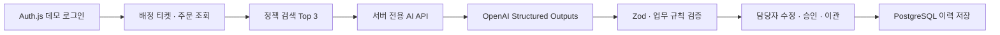

<div align="center">

# CS Copilot

정책 근거와 주문 맥락을 함께 보여 주고, 상담사가 최종 판단하도록 돕는 AI 고객센터 백오피스

[**라이브 데모 → https://cs-copilot-pearl.vercel.app**](https://cs-copilot-pearl.vercel.app/)

</div>

## 프로젝트 소개

고객 문의 한 건을 처리하려면 주문 상태를 확인하고, 여러 정책에서 적용 조건을 찾고, 고객에게 보낼
답변까지 작성해야 합니다. CS Copilot은 이 과정을 하나의 작업 화면으로 연결한 데모 프로젝트입니다.

단순히 답변을 생성하는 챗봇이 아닙니다. 문의와 주문에 맞는 정책을 먼저 검색하고, AI가 사용한
근거와 신뢰도, 추가 확인이 필요한 정보를 답변 초안과 함께 제시합니다. 상담사는 제안을 수정하거나
임시 저장하고, 최종 승인 또는 다른 담당자에게 이관할 수 있습니다.

## 핵심 경험

1. 미리 준비된 윤서연 상담사 데모 계정으로 로그인합니다.
2. 해당 상담사에게 배정된 실무형 문의 중 처리할 티켓을 선택합니다.
3. 고객 문의와 주문·배송 정보를 한 화면에서 확인합니다.
4. 문의 분류, 주문 상태, 키워드를 기준으로 관련 정책 섹션을 최대 3개 검색합니다.
5. AI가 답변 초안, 권장 처리안, 정책 근거, 신뢰도와 추가 확인 정보를 제안합니다.
6. 담당자가 내용을 수정해 승인하거나 임시 저장·이관하고, 결과를 DB 처리 이력으로 남깁니다.

## 이 프로젝트의 강점

### 생성보다 근거를 먼저 찾습니다

Markdown으로 관리하는 정책 문서를 검색 가능한 섹션으로 나누고, 문의 분류·주문 상태·키워드에
가중치를 적용해 관련 정책을 선별합니다. AI에는 검색된 정책만 전달하며, 최종 응답에서도 실제로
전달한 정책 ID와 섹션만 근거로 인정합니다.

### AI 결과를 그대로 신뢰하지 않습니다

OpenAI Structured Outputs와 Zod 스키마로 요청·응답 계약을 일치시키고, 서버에서 다시 업무 규칙을
검증합니다. 정책 근거가 없으면 신뢰도를 1점으로 낮추고 담당자 이관을 권장하며, 정보가 부족하거나
실제 승인이 필요한 처리안은 신뢰도 상한을 적용합니다. AI 호출이 실패하면 실패 상태와 재시도를
표시하고, 준비된 문구를 AI 결과처럼 대신 보여 주지 않습니다.

### 개인정보 전달 범위를 코드로 제한합니다

LLM에는 고객 문의, 식별자를 제외한 관련 주문 정보, 검색된 정책 섹션만 전달합니다. 고객 프로필,
담당자 정보와 처리 이력은 모델 입력에서 제외하고, API 키와 LLM 호출은 서버에만 둡니다.

### 제안 이후의 업무 흐름까지 연결했습니다

답변 생성에서 끝나지 않고 담당자 권한, 초안 수정과 저장, 승인 확인, 담당자 이관, 처리 이력까지
한 흐름으로 구현했습니다. 고객·주문·티켓·초안과 처리 이력은 PostgreSQL에 저장되며, Auth.js
세션의 상담사 ID를 기준으로 배정된 티켓만 조회합니다.

## 동작 구조



## 주요 기여

- 문의, 주문, 정책, 담당자와 처리 이력을 연결한 CS 업무 시나리오 및 데이터 모델 설계
- 티켓 목록, 상세 정보, AI 제안 패널을 결합한 반응형 백오피스 UI 구현
- 카테고리·주문 상태·키워드 가중치를 활용한 정책 섹션 검색과 근거 노출 구현
- OpenAI SDK, Structured Outputs, Zod를 사용한 서버 전용 LLM 파이프라인 구축
- 정책 근거 검증, 신뢰도 보정, 담당자 이관 등 AI 안전장치 설계
- Auth.js 데모 세션, 상담사 권한과 배정 티켓 조회 구현
- PostgreSQL·Prisma 기반 초안, 승인, 담당자 이관과 처리 이력 저장 구현
- 승인·이관 트랜잭션 및 동시 수정 충돌 검사 구현
- 20개 실무형 평가 사례와 자동 테스트를 통한 정책 검색 및 데이터 허용 목록 검증
- Vercel 배포, Preview 보호와 AI API Rate Limiting을 포함한 공개 데모 운영 구성

## 기술 스택

| 영역 | 기술 |
| --- | --- |
| Web | Next.js 16, React 19, TypeScript |
| UI | Tailwind CSS 4 |
| Server State | TanStack Query, Axios |
| Database | PostgreSQL |
| ORM | Prisma |
| Auth | Auth.js |
| AI | OpenAI Responses API, Structured Outputs |
| Validation | Zod |
| Deployment | Vercel |

## 로컬 실행

```bash
npm install
cp .env.example .env.local
```

`.env.local`에 PostgreSQL 연결 정보, Auth.js secret과 서버 전용 API 키를 설정합니다.
`DATABASE_URL`에는 애플리케이션 트래픽용 pooled URL을, `DIRECT_URL`에는 migration용 direct URL을
사용합니다. `OPENAI_MODEL`은 선택 사항입니다.

```dotenv
DATABASE_URL=
DIRECT_URL=
AUTH_SECRET=
AUTH_TRUST_HOST=true
OPENAI_API_KEY=your_api_key
OPENAI_MODEL=gpt-5.4-nano
```

처음 구성한 DB에는 migration과 초기 데이터를 적용합니다.

```bash
npm run db:migrate:deploy
npm run db:seed
```

```bash
npm run dev
```

자세한 Neon·Vercel 연결 및 운영 절차는
[`docs/database-setup.md`](docs/database-setup.md)를 참고하세요.

## 검증

```bash
npm test
npm exec tsc -- --noEmit
npm run build
```

자동 테스트는 정책 검색 상위 3개 재현율, 주문 날짜 파생값, LLM 전달 데이터 허용 목록, 응답 근거와
신뢰도 보정 규칙, 상담사 권한 및 저장 요청 계약을 확인합니다. 상세한 도메인 구조는
[`docs/data-model.md`](docs/data-model.md)에서 볼 수 있습니다.

## 현재 범위

이 프로젝트는 제품 흐름을 검증하기 위한 데모입니다. 로그인은 자유 회원가입이 아닌 seed된 윤서연
상담사 계정으로만 시작합니다. 정책 원본과 검색 인덱스는 아직 Git의 Markdown·JSON으로 관리하며,
실제 고객 메시지 발송과 결제·환불 실행은 포함하지 않습니다. 모든 AI 처리안은 제안이며 실제 실행
전에 담당자의 확인 또는 승인이 필요합니다.
